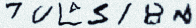
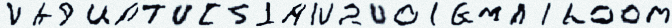
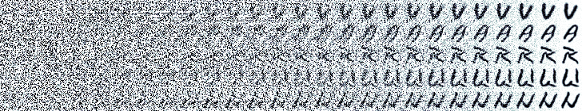
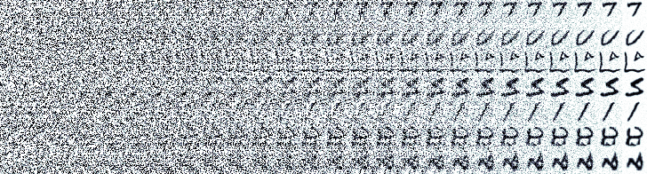

# Density estimation using Diffusion models (Pytorch + Jax/Haiku/Optax)

#### I will be demonstrating critical concepts of the diffusion model using a toy 2D distribution first, followed by using the same concepts on the EMNIST datasets.

*Completed the following*

* Ground truth data estimation/ Error estimation/ Score estimation of diffusion process [Toy Examples -1]
* Cosine and linear schedules [Toy Examples - 1]
* Clipping to improve stabalization of the generation process [Toy Examples - 2]
* Time embedding to encode timestep in model [Toy Examples - improvements]
* Classifier free guidance and semi supervised model training [Toy Examples - improvements]
* Faster sampling in generation process using striding steps in denoising [Toy Examples - improvements]
* EMNIST data generation using U-nets and JAX -- 
  * [Colab Notebook]
  * [EMNIST Notebook]

[Colab Notebook]: https://github.com/varun-ml/diffusion-models-tutorial/blob/master/emnist-colab-notebooks/colab_EMNIST_conditional.diffusion_model.large.with_batch_norm.ipynb
[EMNIST Notebook]: https://github.com/varun-ml/diffusion-models-tutorial/blob/master/EMNIST.diffusion_model.ipynb
[Toy Examples - improvements]: https://github.com/varun-ml/diffusion-models-tutorial/blob/master/toy-density-estimation/guidance_free_classifiers.ipynb
[Toy Examples - 1]: https://github.com/varun-ml/diffusion-models-tutorial/blob/master/toy-density-estimation/vanilla_diffusion_model.ipynb
[Toy Examples - 2]: https://github.com/varun-ml/diffusion-models-tutorial/blob/master/toy-density-estimation/errors.diffusion_model_interpretations.ipynb

*Unexplored ideas*
* List of ideas yet to explore: [Ideas Notebook]

[Ideas Notebook]: https://github.com/varun-ml/diffusion-models-tutorial/blob/master/toy-density-estimation/improvements_diffusion_models_ideas.ipynb

## Generating names using EMNIST

#### Conditional denoising using the trained UNet model 

## Generation toy distributions using diffusion models
#### Parabola 

#### Circles

#### Half Moon

#### Circles + half-moon

#### Circles + moon using Clipping 

#### Generating class-conditioned distributions

#### Generating class-conditioned distributions (few shots only using 2k samples)

 Circles + Half moons generated using class conditioned score estimation in denoising process + using clipping")
