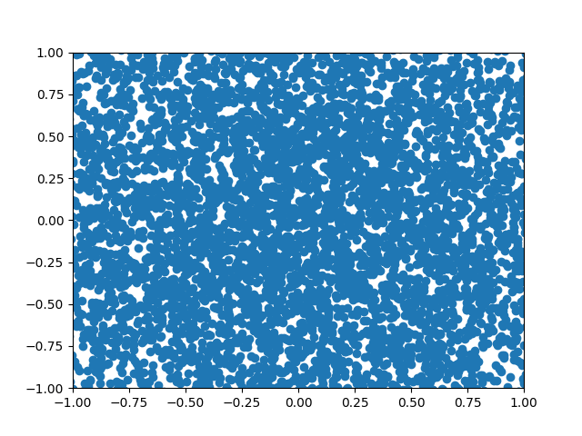
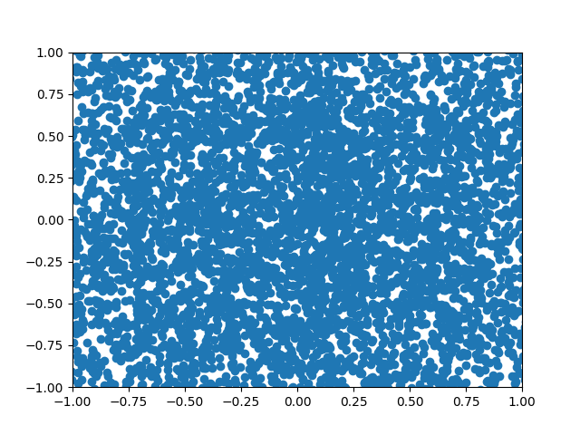
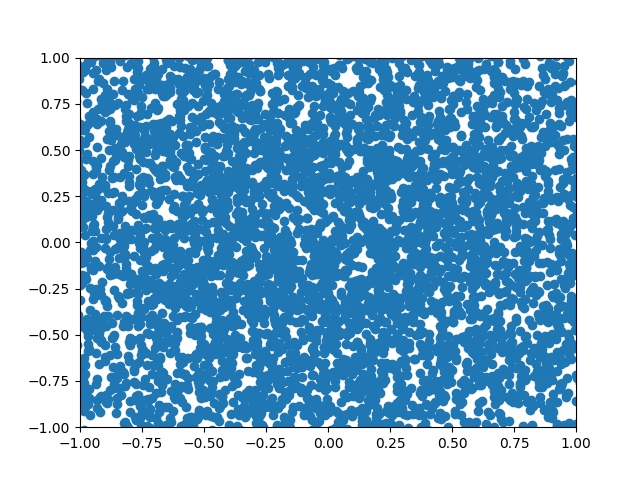

# Work on Density estimation using Diffusion models (Pytorch + Jax)

#### Will be demonstrating critical concepts of diffusion model using some toy 2d distribution firstly, followed by using same concepts on EMNIST datasets

*Done*

* Ground truth data estimation/ Error estimation/ Score estimation of diffusion process
* Cosine and linear schedules
* Clipping to improve stabalization of the generation process
* Time embedding to encode timestep in model
* Classifier free guidance and semi supervised model training
* Faster sampling in generation process using striding steps in denoising

*Pending*
* Learning the schedule
* EMNIST data generation using U-nets and JAX 

## Generation toy distributions using diffusion models
1. Parabola 

2. Circles

3. Half Moon

5. Circles + half-moon

7. Circles + moon using Clipping 

8. Generating class-conditioned distributions

9. Generating class-conditioned distributions (few shots only using 2k samples)

 Circles + Half moons generated using class conditioned score estimation in denoising process + using clipping")
